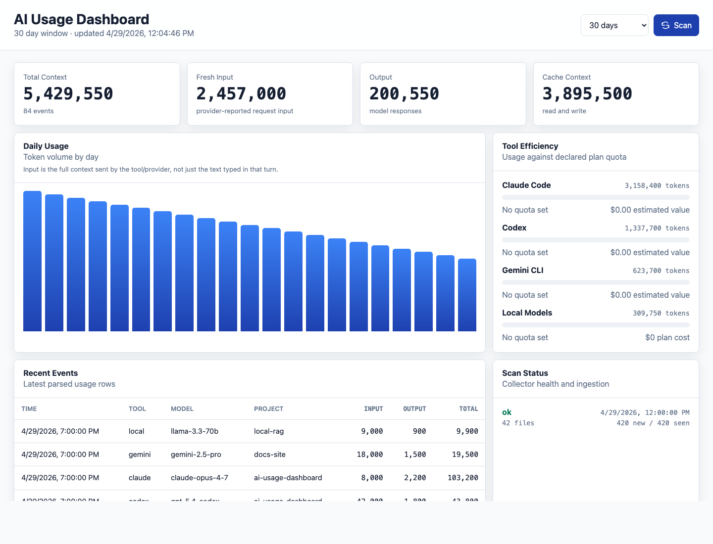

# AI Usage Dashboard

Local-first web dashboard for tracking token and context usage across AI coding tools.

The app runs a Go web service, stores parsed usage events in SQLite, and serves a lightweight dashboard. It only reads configured log/session files and writes to its own `data/usage.db`.



## Demo


[View the MP4 demo](docs/assets/dashboard-demo.mp4)

The README media uses synthetic demo data. It does not include local usage history or project paths.

## What It Tracks

- Fresh input tokens reported by the tool/provider.
- Output tokens.
- Cache read/write context tokens when available.
- Usage by tool, model, project, day, and recent event.
- Plan cost assumptions from config.

Token counts are provider/tool-reported context usage. For agent CLIs, a short user prompt can still produce high input tokens because the request may include system instructions, repository instructions, conversation history, tool outputs, file snippets, and cached context.

See [SUPPORTED.md](SUPPORTED.md) for the tool/model support matrix. The dashboard is model-agnostic: it records any model name emitted by a supported log source.

## Run Locally

```bash
go test ./...
go run ./cmd/server
```

Open `http://localhost:8080`.

If `8080` is already in use:

```bash
AI_USAGE_ADDR=:8090 go run ./cmd/server
```

Open `http://localhost:8090`.

## Run With Docker

```bash
cp .env.example .env
AI_USAGE_UID=$(id -u) AI_USAGE_GID=$(id -g) docker compose up --build -d
```

Open `http://localhost:8090`.

The UID/GID override lets the container read local Claude/Codex log files that are only readable by your macOS user. Source log mounts remain read-only.

## Configure Tools And Plans

Edit `config.example.json` or copy it to `config.json` and update `docker-compose.yml` to mount that file instead.

Important fields:

- `name`: stable machine-readable tool key.
- `display_name`: label shown in the UI.
- `enabled`: whether to scan this tool.
- `monthly_cost_usd`: plan price used for estimated value calculations.
- `monthly_quota_tokens`: optional quota for usage percentage.
- `log_paths`: read-only glob patterns inside the container.

The parser supports JSONL and plain text lines that expose common token fields such as `input_tokens`, `output_tokens`, `prompt_tokens`, `completion_tokens`, `cache_read_input_tokens`, `cache_creation_input_tokens`, and `total_tokens`.

Use `config.max-plan.example.json` if you want a starting point where Codex, Claude, Antigravity, and GodClaude are all assumed to cost `$200/month`. Keep `monthly_quota_tokens` at `0` unless the provider exposes a real token quota, because Max-style plans usually use rolling rate limits rather than a stable monthly token cap.

## Add Any Tool

Add another entry to `tools`:

```json
{
  "name": "my-tool",
  "display_name": "My Tool",
  "enabled": true,
  "monthly_cost_usd": 20,
  "monthly_quota_tokens": 0,
  "parser": "generic-jsonl",
  "log_paths": [
    "/host/path/to/my-tool/**/*.jsonl",
    "~/Library/Application Support/MyTool/logs/*.log"
  ]
}
```

The current parsers are schema-tolerant. For unsupported formats, add a sample line and extend `internal/collector/parser.go`.

## Operational Notes

- The collector is retry-safe. It imports full history once, stores per-file offsets, and deduplicates events by hash.
- Source log mounts are read-only.
- Scan results are recorded in SQLite for debugging.
- If you need to re-import old files after changing parser logic, stop the app and remove `data/usage.db`.
- If a tool changes its log schema, add a sample line and extend `internal/collector/parser.go`.
- Do not publish `data/usage.db`; it can contain project paths and usage metadata.
